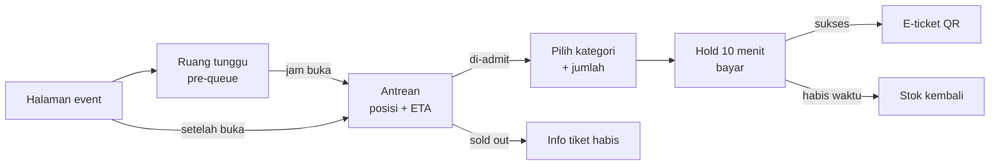
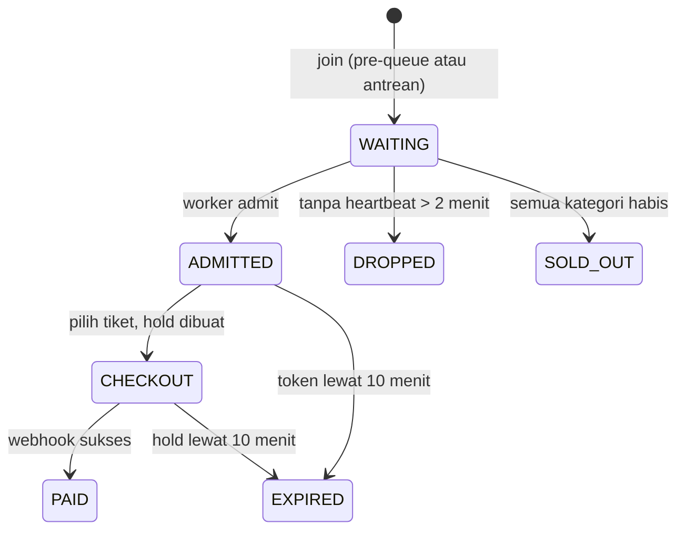
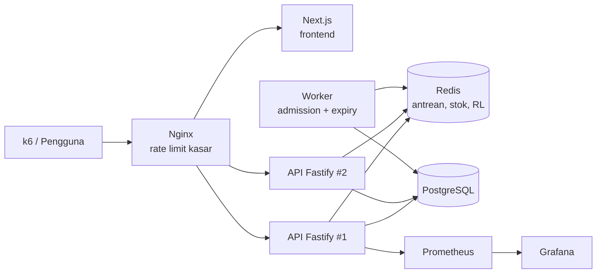

# PRD — War Tiket Konser dengan Virtual Queue

Sep 25, 2026 · @Aditama

## Ringkasan Produk

Proyek ini membangun sistem penjualan tiket konser yang tetap stabil saat ribuan orang masuk di detik yang sama, dengan virtual queue berbasis Redis sebagai ruang tunggu sebelum halaman checkout. Server hanya melayani pembeli dalam jumlah terkendali, tiket tidak pernah terjual melebihi kuota, dan klaim itu dibuktikan dengan load test k6.

Nama kerja: **AntreTix**. Proyek ini melanjutkan konsep flash-sale-system (anti-oversell) dengan tambahan antrean, rate limiting, dan pengujian beban. Target rilis v1.0: 3 minggu sejak kickoff.

## Latar Belakang dan Masalah

Penjualan tiket konser populer di Indonesia sering berujung situs down, halaman error, atau pembeli yang sudah membayar tapi tiketnya tidak ada. Penyebabnya bukan hanya server kurang besar, tetapi karena seluruh lonjakan traffic langsung menghantam database dan proses checkout.

Masalah yang ingin diselesaikan:

- **Traffic spike**: puluhan ribu request dalam beberapa detik pertama membuat database kehabisan koneksi.
- **Oversell**: dua pembeli sama-sama berhasil membeli kursi atau kuota terakhir.
- **Ketidakadilan**: yang menang adalah yang paling sering refresh atau memakai bot, bukan yang datang lebih dulu.
- **Ketidakjelasan**: pengguna tidak tahu posisinya di antrean dan berapa lama harus menunggu.
- **Bot dan calo**: satu orang membuka banyak tab atau akun untuk memborong tiket.

Virtual queue memindahkan lonjakan ke Redis yang murah dan cepat, lalu mengalirkan pembeli ke checkout dengan laju yang sanggup ditangani database.

## Tujuan, Non-tujuan, dan Metrik Keberhasilan

**Tujuan**

1. Menyediakan ruang tunggu dan antrean yang adil, dengan posisi dan estimasi waktu tunggu yang terlihat.
2. Membatasi jumlah pembeli aktif di checkout sesuai kapasitas sistem.
3. Menjamin nol oversell per kategori tiket.
4. Menahan bot dan spam lewat rate limiting, CAPTCHA, dan batas tiket per akun.
5. Membuktikan ketahanan sistem dengan load test k6 yang membandingkan skenario tanpa antrean vs dengan antrean.

**Non-tujuan (di luar scope v1.0)**

- Pemilihan kursi bernomor di denah venue; v1.0 memakai kategori festival/tribun berbasis kuota.
- Pembayaran produksi; v1.0 memakai Midtrans sandbox atau mock payment.
- Resale tiket resmi dan transfer tiket antar pengguna.
- Aplikasi mobile native.

**Metrik keberhasilan**

| Metrik | Target |
| --- | --- |
| Tiket terjual melebihi kuota | 0 di semua skenario load test |
| Lonjakan 5.000 VU masuk antrean dalam 10 detik | Error rate < 1% |
| Latensi p95 join antrean | < 300 ms |
| Latensi p95 cek posisi antrean | < 150 ms |
| Latensi p95 checkout (pengguna yang sudah diizinkan masuk) | < 800 ms |
| Koneksi database saat puncak | Tidak melebihi pool yang dikonfigurasi |
| Skenario tanpa antrean (pembanding) | Terdokumentasi kegagalannya: error rate dan latensi tinggi |

Angka target adalah asumsi awal untuk mesin uji tunggal dan akan dikalibrasi setelah uji baseline.

## Persona dan User Stories

| Persona | Kebutuhan utama |
| --- | --- |
| Pembeli (fans) | Kesempatan adil, tahu posisi antrean, checkout tidak error |
| Promotor/admin event | Membuat event dan kategori tiket, mengatur kapasitas antrean, memantau penjualan real-time |
| Engineer/penilai portofolio | Melihat bukti teknis: arsitektur, hasil load test, dan cara mencegah oversell |

**User stories: pembeli**

- [ ] Saya ingin masuk ruang tunggu sebelum penjualan dibuka, agar tidak perlu refresh terus-menerus.
- [ ] Saya ingin melihat posisi antrean dan estimasi waktu tunggu yang diperbarui otomatis.
- [ ] Saya ingin posisi saya tidak hilang jika tidak sengaja me-refresh halaman.
- [ ] Saya ingin tiket yang saya pilih ditahan selama saya membayar, dengan hitung mundur yang jelas.
- [ ] Saya ingin langsung tahu jika kategori tiket habis, tanpa harus mengantre sampai akhir.
- [ ] Saya ingin menerima e-ticket dengan QR setelah pembayaran berhasil.

**User stories: admin**

- [ ] Saya ingin membuat event, kategori tiket, kuota, harga, dan jadwal penjualan.
- [ ] Saya ingin mengatur berapa pengguna yang boleh masuk checkout per detik dan maksimal pengguna aktif.
- [ ] Saya ingin memantau panjang antrean, jumlah pengguna aktif, dan sisa kuota secara real-time.
- [ ] Saya ingin menjeda antrean jika terjadi masalah pembayaran.

## Kebutuhan Fungsional

| ID | Modul | Kebutuhan | Prioritas |
| --- | --- | --- | --- |
| F-01 | Auth | Login (Google/email), satu akun = satu posisi antrean per event | Wajib |
| F-02 | Event | Halaman event: info, kategori tiket, harga, hitung mundur penjualan | Wajib |
| F-03 | Ruang tunggu | Pre-queue dibuka 30 menit sebelum penjualan; posisi diacak adil saat penjualan dimulai | Wajib |
| F-04 | Antrean | Join antrean setelah penjualan dibuka, urutan FIFO | Wajib |
| F-05 | Antrean | Cek posisi + ETA via SSE, fallback polling 5 detik | Wajib |
| F-06 | Admission | Worker memasukkan N pengguna per detik ke sesi aktif, dengan batas maksimal pengguna aktif | Wajib |
| F-07 | Admission | Access token bertanda tangan (TTL 10 menit) sebagai syarat akses checkout | Wajib |
| F-08 | Inventori | Reservasi tiket atomik via Redis Lua + update bersyarat di PostgreSQL | Wajib |
| F-09 | Inventori | Hold tiket 10 menit; stok kembali otomatis jika tidak dibayar | Wajib |
| F-10 | Checkout | Idempotency key per order, maksimal 4 tiket per akun per event | Wajib |
| F-11 | Pembayaran | Midtrans sandbox atau mock payment dengan webhook | Wajib |
| F-12 | Tiket | E-ticket dengan kode unik dan QR | Wajib |
| F-13 | Proteksi | Rate limiting per IP dan per user (sliding window di Redis) | Wajib |
| F-14 | Proteksi | Cloudflare Turnstile saat join antrean | Wajib |
| F-15 | Sold out | Saat semua kategori habis, antrean ditutup dan semua pengguna diberi tahu | Wajib |
| F-16 | Admin | CRUD event dan kategori, pengaturan laju admission, tombol pause/resume antrean | Wajib |
| F-17 | Admin | Dashboard real-time: panjang antrean, pengguna aktif, sisa kuota, order per menit | Wajib |
| F-18 | Ops | Rekonsiliasi berkala stok Redis vs PostgreSQL | Wajib |
| F-19 | Observability | Metrik Prometheus + dashboard Grafana | Opsional |

## Aturan Bisnis

| Aturan | Nilai v1.0 |
| --- | --- |
| Event demo | 1 konser, 3 kategori: Festival (3.000), Tribun (1.500), VIP (500) = 5.000 tiket |
| Pre-queue | Dibuka 30 menit sebelum penjualan |
| Urutan pre-queue | Diacak saat penjualan dimulai (semua yang datang sebelum jam buka punya peluang sama) |
| Urutan setelah jam buka | FIFO berdasarkan waktu join, di belakang peserta pre-queue |
| Laju admission | 50 pengguna/detik (dapat diubah admin) |
| Maksimal pengguna aktif di checkout | 500 (dapat diubah admin) |
| Masa berlaku access token | 10 menit sejak diizinkan masuk |
| Heartbeat antrean | Wajib tiap ≤ 60 detik; lebih dari 2 menit tanpa heartbeat = dikeluarkan |
| Grace period reconnect | 2 menit, posisi tetap jika kembali dengan akun yang sama |
| Batas tiket | Maksimal 4 tiket per akun per event, lintas semua order |
| Hold tiket | 10 menit untuk menyelesaikan pembayaran |
| Harga | Dikunci saat hold dibuat |

Semua angka disimpan di konfigurasi event, bukan hard-code, agar bisa diubah untuk skenario load test.

## Desain Virtual Queue

Antrean disimpan sebagai Redis sorted set; semua operasi penting (join, admission, pembersihan) berjalan atomik lewat Lua script, sehingga tidak ada race condition antar instance API.

**Skor antrean yang sekaligus adil dan FIFO**

- Join saat pre-queue: skor = angka acak `[0, 1)`. Posisi belum ditampilkan sampai jam buka, sehingga urutannya berupa undian.
- Join setelah jam buka: skor = timestamp milidetik (jauh lebih besar dari 1), sehingga otomatis berada di belakang semua peserta pre-queue dan berurutan FIFO.
- Join memakai `ZADD NX`, sehingga refresh atau request ulang tidak mengubah posisi.

Dengan trik ini tidak diperlukan proses migrasi data saat jam buka; satu sorted set sudah cukup.

**Admission worker**

Satu worker aktif (leader dipilih lewat `SET lock NX PX`) menjalankan Lua script setiap 1 detik:

1. Hapus sesi aktif yang kedaluwarsa: `ZREMRANGEBYSCORE active -inf now`.
2. Hitung kursi kosong: `slot = min(laju_admission, maks_aktif - ZCARD active)`.
3. Ambil pengguna terdepan: `ZPOPMIN queue slot`.
4. Masukkan ke `active` dengan skor `now + 10 menit`, lalu tandai `admitted:{event}:{user}`.
5. Jika semua kategori habis, set `status:{event} = SOLD_OUT` dan hentikan admission.

**Posisi dan estimasi waktu**

Posisi = `ZRANK queue user` + 1. Estimasi tunggu memakai throughput aktual 60 detik terakhir, bukan laju teoritis, karena sebagian pengguna aktif keluar lebih cepat atau lebih lambat:

```latex
\text{ETA (detik)} = \frac{\text{posisi}}{\text{rata-rata pengguna di-admit per detik (60 detik terakhir)}}
```

**Heartbeat dan reconnect**

Klien mengirim heartbeat lewat koneksi SSE atau polling. Pengguna yang tidak ada kabar lebih dari 2 menit dikeluarkan oleh job pembersih (`ZREM`), agar tab yang ditutup tidak memperlambat antrean. Karena posisi terikat ke akun, bukan ke tab, membuka tab baru tidak memberi posisi tambahan.

**Access token**

Saat klien mendapati dirinya sudah di-admit, server menerbitkan JWT berisi `userId`, `eventId`, dan `exp` 10 menit. Semua endpoint checkout menolak request tanpa token valid, sehingga tidak ada jalan pintas melewati antrean.

## Anti-Oversell, Rate Limiting, dan Anti-Bot

Oversell dicegah dengan dua lapis: Redis menolak lebih awal dan cepat, PostgreSQL menjadi penjaga terakhir yang tidak bisa dilewati.

**Lapis 1: reservasi atomik di Redis (Lua)**

```lua
-- KEYS[1]=stock:{event}:{cat}  KEYS[2]=bought:{event}:{user}
-- ARGV[1]=qty  ARGV[2]=max_per_user
local stock  = tonumber(redis.call('GET', KEYS[1]) or '0')
local bought = tonumber(redis.call('GET', KEYS[2]) or '0')
local qty    = tonumber(ARGV[1])
if bought + qty > tonumber(ARGV[2]) then return -2 end
if stock < qty then return -1 end
redis.call('DECRBY', KEYS[1], qty)
redis.call('INCRBY', KEYS[2], qty)
return stock - qty
```

Return `-1` = stok habis, `-2` = melebihi batas per akun. Karena Lua dieksekusi atomik di Redis, cek dan pengurangan stok tidak bisa disela request lain.

**Lapis 2: update bersyarat di PostgreSQL**

```sql
UPDATE ticket_categories
SET reserved = reserved + $qty
WHERE id = $cat AND sold + reserved + $qty <= quota
RETURNING id;
```

Jika tidak ada baris yang berubah, order dibatalkan dan stok Redis dikembalikan. Tabel juga diberi `CHECK (sold + reserved <= quota)` sebagai pengaman di level skema.

**Pengembalian stok**

Order `PENDING` yang lewat 10 menit diubah ke `EXPIRED` oleh job tiap 30 detik, lalu `reserved` dikurangi dan stok Redis di-`INCRBY` kembali dalam satu alur idempoten. Job rekonsiliasi tiap 1 menit membandingkan `quota - sold - reserved` di PostgreSQL dengan stok Redis dan mencatat selisih.

**Rate limiting**

| Endpoint | Batas | Kunci |
| --- | --- | --- |
| Join antrean | 5 request/menit | per IP + per user |
| Cek status antrean | 30 request/menit | per user |
| Checkout | 10 request/menit | per user |
| Global per IP | 120 request/menit | per IP |

Algoritma sliding window log memakai sorted set Redis per kunci, dieksekusi dengan Lua. Request yang melewati batas mendapat HTTP 429 dan header `Retry-After`.

**Anti-bot**

- Cloudflare Turnstile wajib saat join antrean; token diverifikasi di server.
- Satu akun hanya punya satu posisi antrean per event (dijamin `ZADD NX`).
- Access token terikat ke `userId`, tidak bisa dipakai akun lain.
- Batas 4 tiket per akun dicek di Redis dan PostgreSQL.
- Log IP yang menghasilkan banyak akun untuk ditinjau admin (tanpa blokir otomatis di v1.0).

## Model Data

Redis menyimpan state yang cepat berubah dan boleh hilang sementara; PostgreSQL menyimpan order, tiket, dan kuota sebagai sumber kebenaran.

**Redis keys**

| Key | Tipe | Isi | TTL |
| --- | --- | --- | --- |
| `queue:{event}` | Sorted set | member = userId, skor = acak (pre-queue) atau timestamp ms | Sampai event selesai |
| `active:{event}` | Sorted set | member = userId, skor = waktu kedaluwarsa sesi | Dibersihkan worker |
| `admitted:{event}:{user}` | String | `1` sebagai penanda sudah di-admit | 10 menit |
| `hb:{event}:{user}` | String | Timestamp heartbeat terakhir | 2 menit |
| `stock:{event}:{cat}` | String (int) | Sisa stok kategori | Sampai event selesai |
| `bought:{event}:{user}` | String (int) | Jumlah tiket yang sudah dipegang akun | Sampai event selesai |
| `status:{event}` | String | `PREQUEUE`, `OPEN`, `PAUSED`, `SOLD_OUT`, `CLOSED` | - |
| `config:{event}` | Hash | Laju admission, maks aktif, batas per akun | - |
| `rl:{scope}:{id}` | Sorted set | Timestamp request untuk sliding window | 1–2 menit |
| `stats:{event}:admit` | Sorted set | Log admission per detik untuk hitung ETA | 5 menit |
| `lock:admission:{event}` | String | Leader lock worker | 5 detik (diperpanjang) |

**Skema PostgreSQL (Prisma)**

```prisma
enum OrderStatus { PENDING PAID EXPIRED CANCELLED REFUNDED }
enum EventStatus { DRAFT SCHEDULED ON_SALE SOLD_OUT ENDED }

model User {
  id     String  @id @default(cuid())
  email  String  @unique
  name   String
  role   String  @default("CUSTOMER")
  orders Order[]
}

model Event {
  id            String           @id @default(cuid())
  name          String
  venue         String
  startsAt      DateTime
  saleOpensAt   DateTime
  preQueueAt    DateTime
  status        EventStatus      @default(DRAFT)
  admitPerSec   Int              @default(50)
  maxActive     Int              @default(500)
  maxPerUser    Int              @default(4)
  categories    TicketCategory[]
  orders        Order[]
}

model TicketCategory {
  id       String  @id @default(cuid())
  eventId  String
  event    Event   @relation(fields: [eventId], references: [id])
  name     String  // Festival, Tribun, VIP
  price    Int
  quota    Int
  sold     Int     @default(0)
  reserved Int     @default(0)
  orderItems OrderItem[]
  // CHECK (sold + reserved <= quota) via migrasi SQL
}

model Order {
  id             String      @id @default(cuid())
  code           String      @unique
  userId         String
  user           User        @relation(fields: [userId], references: [id])
  eventId        String
  event          Event       @relation(fields: [eventId], references: [id])
  status         OrderStatus @default(PENDING)
  totalPrice     Int
  expiresAt      DateTime
  idempotencyKey String      @unique
  paidAt         DateTime?
  items          OrderItem[]
  tickets        Ticket[]
  createdAt      DateTime    @default(now())

  @@index([status, expiresAt])
}

model OrderItem {
  id         String         @id @default(cuid())
  orderId    String
  order      Order          @relation(fields: [orderId], references: [id])
  categoryId String
  category   TicketCategory @relation(fields: [categoryId], references: [id])
  qty        Int
  unitPrice  Int
}

model Ticket {
  id        String   @id @default(cuid())
  orderId   String
  order     Order    @relation(fields: [orderId], references: [id])
  code      String   @unique // isi QR
  checkedIn Boolean  @default(false)
}
```

## Alur Pengguna dan State Machine

Pengguna melewati empat tahap: ruang tunggu, antrean, checkout, dan tiket. Setiap tahap punya penjaga sendiri, sehingga lonjakan tidak pernah langsung sampai ke database.



Status antrean seorang pengguna:



Status order di PostgreSQL mengikuti `PENDING → PAID`, atau `PENDING → EXPIRED` dengan pengembalian stok. Webhook yang datang setelah `EXPIRED` memicu refund, sama seperti pola di proyek booking lapangan.

## Desain API

API ditulis dengan Fastify (Node.js), input divalidasi Zod, dan error memakai format `{ code, message }`. Endpoint checkout mewajibkan header `X-Queue-Token`.

| Method | Endpoint | Akses | Keterangan |
| --- | --- | --- | --- |
| GET | `/events/:id` | Publik | Info event, kategori, status penjualan |
| POST | `/events/:id/queue` | User + Turnstile | Join pre-queue atau antrean |
| GET | `/events/:id/queue/status` | User | Posisi, ETA, status; mengembalikan token jika sudah di-admit |
| GET | `/events/:id/queue/stream` | User | SSE: update posisi dan heartbeat |
| DELETE | `/events/:id/queue` | User | Keluar antrean |
| GET | `/events/:id/stock` | Token | Sisa stok per kategori (dari Redis) |
| POST | `/events/:id/orders` | Token + `Idempotency-Key` | Reservasi tiket + buat order `PENDING` |
| GET | `/orders/:id` | Pemilik | Status order dan tiket |
| POST | `/payments/webhook` | Payment provider | Verifikasi signature, set `PAID` atau refund |
| POST | `/admin/events` | Admin | Buat/ubah event dan kategori |
| PATCH | `/admin/events/:id/queue` | Admin | Ubah laju admission, maks aktif, pause/resume |
| GET | `/admin/events/:id/metrics` | Admin | Panjang antrean, aktif, stok, order/menit |
| GET | `/metrics` | Internal | Metrik format Prometheus |

**Kode respons penting**

| Kode | Arti |
| --- | --- |
| 202 `QUEUED` | Berhasil masuk antrean |
| 200 `ADMITTED` | Sudah di-admit, token dikirim |
| 401 `QUEUE_TOKEN_REQUIRED` | Mencoba checkout tanpa melewati antrean |
| 409 `OUT_OF_STOCK` | Kategori habis |
| 409 `LIMIT_EXCEEDED` | Melebihi 4 tiket per akun |
| 410 `SOLD_OUT` | Event habis, antrean ditutup |
| 429 `RATE_LIMITED` | Melewati batas request, dengan `Retry-After` |

## Halaman dan UI

| Halaman | Isi utama |
| --- | --- |
| Event `/events/[id]` | Poster, info konser, kategori + harga, hitung mundur, tombol "Masuk Ruang Tunggu" |
| Ruang tunggu `/events/[id]/waiting` | Pesan bahwa urutan akan diundi saat jam buka, hitung mundur, indikator koneksi |
| Antrean `/events/[id]/queue` | Nomor posisi besar, progress bar, ETA, jumlah orang di depan, peringatan "jangan tutup tab" |
| Pilih tiket `/events/[id]/checkout` | Sisa waktu sesi, pilihan kategori + jumlah (maks. 4), sisa stok, total harga |
| Pembayaran `/orders/[id]/pay` | Hitung mundur hold, tombol bayar, status real-time |
| E-ticket `/orders/[id]` | QR per tiket, detail kategori, tombol unduh |
| Sold out | Pesan tiket habis, ajakan follow event berikutnya |
| Admin: Event `/admin/events` | CRUD event dan kategori |
| Admin: Live `/admin/events/[id]/live` | Grafik panjang antrean, pengguna aktif, order per menit, sisa stok; slider laju admission; tombol pause |

**Aturan UX**

- Halaman antrean dibuat sangat ringan (tanpa gambar besar) dan bisa di-cache CDN, karena di sinilah ribuan pengguna menunggu.
- ETA ditampilkan sebagai rentang ("sekitar 4–6 menit"), bukan angka pasti.
- Saat koneksi SSE putus, klien otomatis beralih ke polling dan menampilkan status "menyambung ulang".
- Membuka tab kedua menampilkan posisi yang sama, bukan posisi baru.

## Arsitektur dan Tech Stack

Frontend dan API dipisah agar API bisa di-scale horizontal dan diuji beban secara terpisah. Semua komponen berjalan di Docker Compose, sehingga load test bisa diulang di laptop atau satu VPS.



| Lapisan | Pilihan |
| --- | --- |
| Frontend | Next.js 15, TypeScript, Tailwind, shadcn/ui |
| API | Node.js + Fastify, Zod, `@fastify/jwt` |
| Antrean & cache | Redis 7 (`ioredis`, Lua script) |
| Database | PostgreSQL 16 + Prisma (lokal/VPS); Neon untuk demo publik |
| Worker | Proses Node terpisah (BullMQ opsional untuk job expiry) |
| Anti-bot | Cloudflare Turnstile |
| Pembayaran | Midtrans sandbox atau mock provider |
| Reverse proxy | Nginx (`limit_req` sebagai lapis pertama) |
| Load test | k6 + output ke Prometheus |
| Observability | Prometheus + Grafana, `prom-client` |
| Infra | Docker Compose; demo publik di Railway/Fly.io |
| Testing & CI | Vitest, Testcontainers (Redis + Postgres asli), Playwright, GitHub Actions |

**Struktur repo (monorepo pnpm)**

```
antretix/
├── apps/
│   ├── web/              # Next.js
│   ├── api/              # Fastify
│   └── worker/           # admission, expiry, rekonsiliasi
├── packages/
│   ├── lua/              # join.lua, admit.lua, reserve.lua, ratelimit.lua
│   ├── db/               # Prisma schema + migrasi SQL
│   └── shared/           # tipe, validator Zod, konstanta
├── loadtest/
│   ├── scenarios/        # spike-join.js, checkout-storm.js, no-queue.js
│   └── results/          # ringkasan JSON + screenshot Grafana
├── infra/
│   ├── docker-compose.yml
│   ├── nginx.conf
│   └── grafana/          # dashboard JSON
└── README.md
```

## Kebutuhan Non-fungsional dan Strategi Load Test

| Aspek | Kebutuhan |
| --- | --- |
| Integritas | Nol oversell; selisih stok Redis vs PostgreSQL = 0 setelah rekonsiliasi |
| Skalabilitas | API stateless; menambah instance API tidak mengubah kebenaran antrean |
| Ketahanan | Jika Redis restart, antrean bisa hilang tapi order dan kuota di PostgreSQL tetap benar; Redis memakai AOF |
| Keamanan | JWT antrean ditandatangani, signature webhook diverifikasi, secret di env |
| Observability | Metrik: panjang antrean, admit/detik, pengguna aktif, 429/menit, latensi per endpoint, koneksi DB |
| Kualitas kode | ESLint, Prettier, coverage ≥ 70% untuk modul antrean dan inventori |

**Test fungsional**

| Level | Skenario |
| --- | --- |
| Unit | ETA, kebijakan batas per akun, transisi status order |
| Integration (Testcontainers) | 1.000 panggilan `reserve.lua` serentak pada stok 100 → tepat 100 sukses |
| Integration | Join ulang dengan akun sama tidak mengubah posisi |
| Integration | Checkout tanpa token → 401; token akun lain → 401 |
| Integration | Order kedaluwarsa mengembalikan stok tepat satu kali meski job berjalan dua kali |
| E2E (Playwright) | Ruang tunggu → antrean → checkout → bayar mock → e-ticket |

**Skenario load test k6**

| Skenario | Profil beban | Yang dibuktikan |
| --- | --- | --- |
| 1. Tanpa antrean (pembanding) | 0 → 2.000 VU dalam 10 detik langsung ke endpoint order | Database kewalahan: error rate, timeout, latensi melonjak |
| 2. Spike join antrean | 0 → 5.000 VU dalam 10 detik, lalu polling status | Redis menyerap lonjakan, error < 1%, p95 < 300 ms |
| 3. End-to-end dengan antrean | 5.000 VU: join → tunggu admit → order → bayar mock, stok 5.000 | Nol oversell, koneksi DB stabil, semua tiket terjual |
| 4. Oversubscribe | 20.000 pengguna berebut 5.000 tiket | Tepat 5.000 terjual, sisanya menerima `SOLD_OUT` dengan rapi |
| 5. Serangan bot | 50 VU mengirim 100 request/detik ke join | Rate limiter memblokir, pengguna normal tidak terdampak |
| 6. Soak | 500 VU konstan selama 30 menit | Tidak ada kebocoran memori atau penumpukan key Redis |

Setiap skenario dicatat hardware uji, jumlah instance API, laju admission, dan hasilnya. Laporan akhir di README memuat tabel hasil dan screenshot Grafana untuk skenario 1 vs 3 berdampingan.

## Milestone dan Timeline

Total 21 hari kerja dari kickoff (H1). Inti antrean dan inventori dikerjakan lebih dulu, UI menyusul.

| Hari | Milestone | Output |
| --- | --- | --- |
| H1–H2 | Setup | Monorepo, Docker Compose (Redis, Postgres, Nginx), Prisma, seed event demo |
| H3–H5 | Antrean | `join.lua`, `admit.lua`, worker leader, status + ETA, heartbeat, test Testcontainers |
| H6–H7 | Inventori | `reserve.lua`, update bersyarat Postgres, order `PENDING`, expiry + pengembalian stok |
| H8 | Proteksi | Rate limiter Lua, Turnstile, JWT antrean, idempotency |
| H9 | Pembayaran | Mock provider + webhook, e-ticket QR |
| H10–H12 | Frontend pembeli | Halaman event, ruang tunggu, antrean (SSE), checkout, e-ticket |
| H13–H14 | Admin | CRUD event, halaman live, kontrol laju admission dan pause |
| H15 | Observability | Prometheus + Grafana dashboard |
| H16–H18 | Load test | Skrip 6 skenario k6, jalankan, perbaiki bottleneck, ulangi |
| H19 | E2E & CI | Playwright, GitHub Actions |
| H20–H21 | Dokumentasi & demo | README dengan hasil load test, deploy demo publik, video singkat |

## Risiko, Definition of Done, dan Pengembangan Lanjutan

| Risiko | Dampak | Mitigasi |
| --- | --- | --- |
| Laptop/VPS uji menjadi bottleneck, bukan sistemnya | Hasil load test menyesatkan | Jalankan k6 di mesin terpisah bila bisa; catat CPU/RAM mesin k6 dan server |
| Redis managed gratis (mis. Upstash) punya batas request | Load test gagal karena kuota, bukan desain | Load test hanya di Redis Docker lokal/VPS; Redis managed hanya untuk demo publik |
| Stok Redis dan PostgreSQL tidak sinkron | Oversell atau tiket "hilang" | PostgreSQL sebagai penjaga terakhir + rekonsiliasi tiap menit + alert selisih |
| Worker admission mati | Antrean berhenti bergerak | Leader lock dengan TTL pendek, instance worker cadangan mengambil alih |
| Skor acak pre-queue bocor sebelum jam buka | Pengguna tahu posisinya lebih awal | Endpoint status tidak mengembalikan posisi selama status `PREQUEUE` |
| SSE dengan ribuan koneksi membebani API | Latensi naik | Fallback polling, batasi frekuensi push, uji di skenario 2 |

**Definition of Done (v1.0)**

- [ ] Pre-queue terundi, antrean FIFO, posisi + ETA real-time berjalan
- [ ] Checkout hanya bisa diakses dengan token antrean
- [ ] Integration test membuktikan nol oversell pada 1.000 reservasi serentak
- [ ] 6 skenario k6 selesai, hasil dan grafik ada di README
- [ ] Dashboard admin live dengan kontrol laju admission dan pause
- [ ] CI lulus dan demo publik bisa dicoba dengan akun contoh

**Pengembangan lanjutan (v2.0)**

- Pemilihan kursi bernomor dengan lock per kursi (`SET NX` per seat).
- Antrean multi-region atau Redis Cluster untuk skala lebih besar.
- Deteksi bot berbasis perilaku (kecepatan klik, pola request) dengan model ML sederhana.
- Transfer tiket resmi antar akun dan resale dengan harga dibatasi.
- Notifikasi push saat giliran tiba, agar pengguna boleh meninggalkan tab.
